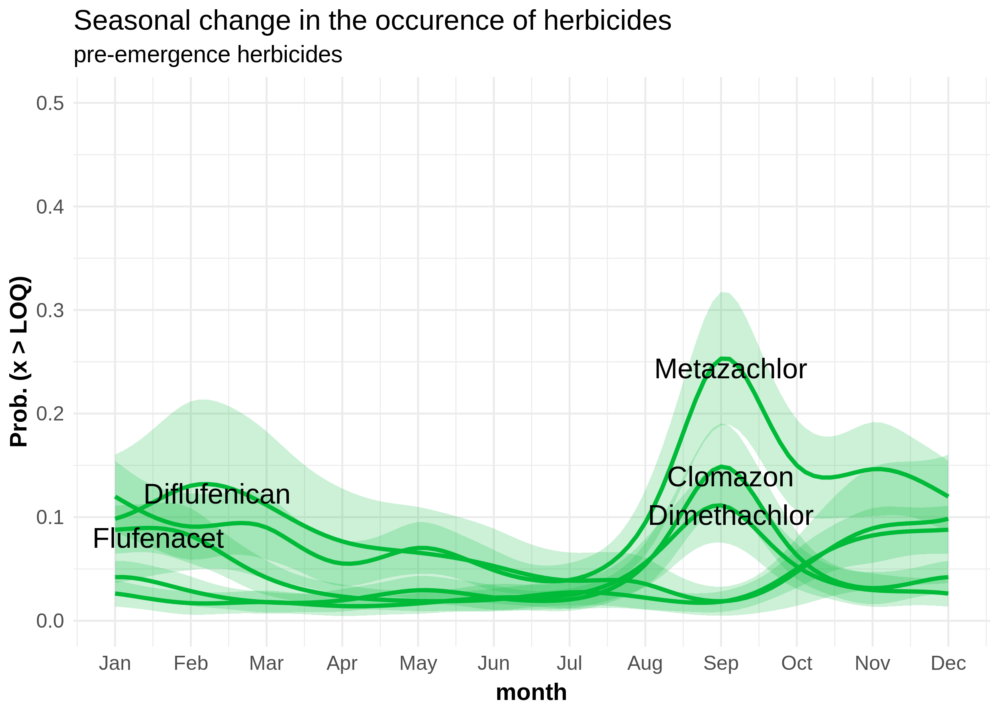
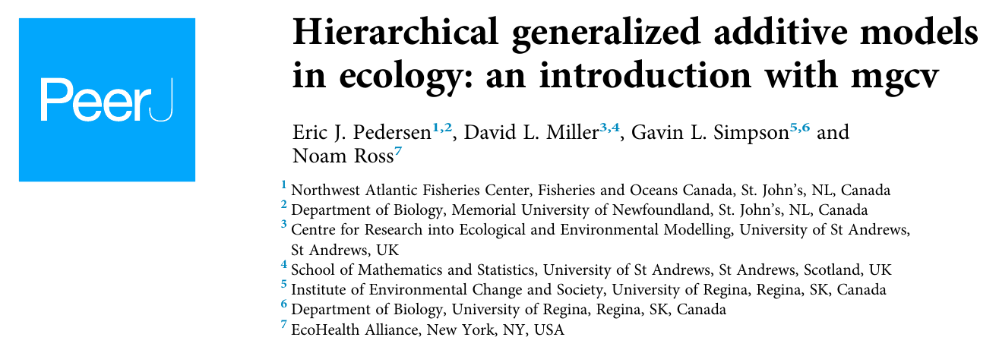
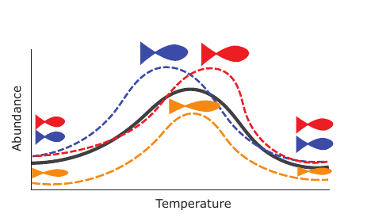
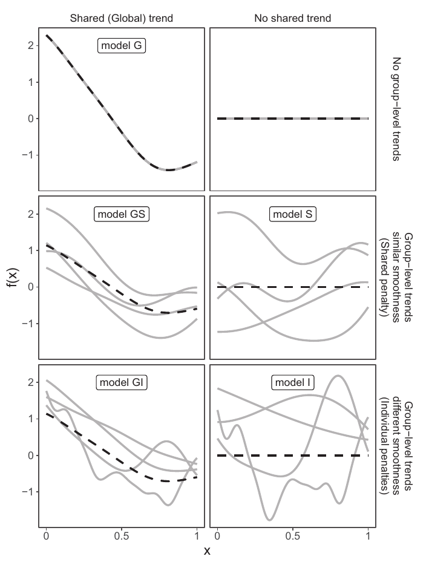

```{r setup, echo=FALSE, include=FALSE}
# packages
require(data.table)
require(ggplot2)
require(cowplot)
require(mgcv)
require(mgcViz)
require(gratia) # GAM helper functions
require(gamair) # Mackarel data set & other GAM Introduction data sets by S. Wood
require(tweetrmd)
require(andmisc) # Personal ggplot2 theme
require(tjmisc)

# switches
online = FALSE

# variables
prj = '~/Projects/teaching'
cachedir = file.path(prj, 'GAM/cache')
creddir = file.path(prj, 'cred')

# knitr settings
knitr::opts_chunk$set(dpi = 300, fig.width = 7)

# plot theme
theme_set(andmisc::theme_as(base_family = 'sans',
                            base_size = 10,
                            text_size = 12))
```

```{r data, echo=FALSE, include=FALSE}
# Ostracoda data ---------------------------------------------------------------
if (online) {
  oc = read.csv('https://datadryad.org/stash/downloads/file_stream/66691',
                sep = '\t')
  saveRDS(oc, file.path(cachedir, 'oc.rds'))
  
} else {
  
  oc = readRDS(file.path(cachedir, 'oc.rds'))
}

# Mackerel data set ------------------------------------------------------------
data('mack')

# Monitoring data --------------------------------------------------------------
if (online) {
  q = "SELECT
          var.name, var.cas, sam.date,
          sam.sample_id, sam.value_fin, sam.unit, sam.loq,
          sit.site_id, sit.area_sqkm, sit.atkis_perc, sit.wwtp
       FROM phch.phch_samples sam
       LEFT JOIN spatial_derived.land_use_ezg5000 sit USING (site_id)
       LEFT JOIN phch.phch_variables var USING (variable_id)
       WHERE var.name IN ('Coffein', 'Metazachlor', 'Metolachlor', 'Pendimethalin')
         AND date >= '2000-01-01'::date"
  
  dat = andmisc::read_query(q, cred_file = file.path(creddir, 'credentials_ger.R'))
  saveRDS(dat, file.path(cachedir, 'dat.rds'))
  
} else {

  dat = readRDS(file.path(cachedir, 'dat.rds'))
}

caff = dat[ name == 'Coffein' ]
mzchlor = dat[ name == 'Metazachlor' ]
mochlor = dat[ name == 'Metolachlor' ]


# 
# 
# 
# ggplot(mzchlor[ value_fin > 0 ]) +
#   geom_point(aes(y = value_fin, x = date)) +
#   scale_x_date(date_breaks = '2 year',
#                date_minor_breaks = '1 year',
#                labels = function(x) format(x, '%Y')) +
#   labs(y = 'Concentration (ug/l)', x = NULL)
# 

# Simulation example -----------------------------------------------------------
# simulation
set.seed(1234)
sim = gamSim(eg = 1, n = 100, dist = "normal", scale = 2, verbose = FALSE)
sim$y = sim$y - (sim$f1 + sim$f0 + sim$f3)
sim$y = sim$y + 5
sim$x = sim$x2

sim = sim[ with(sim, order(x)), ] # TODO Is this the right order?
```

class: center, inverse, middle

# Linear Regression


---
# Linear Model (LM)

- Easy to interpret
- Confined to linear relationships
- Normally distributed responses

$$y_i = \beta_0 + \beta_1x_{1i} + \epsilon_i, \epsilon \sim N(0,\sigma^2)$$

---
# Linear Model (LM)

.pull-left[
```{r eval=FALSE}
lm(y ~ x,
   data = data)
```
]

.pull-right[
__R2:__ `r round(summary(lm(y ~ x, data = sim))$r.squared, 2)`
__AIC:__ `r AIC(lm(y ~ x, data = sim))`
]

```{r echo=FALSE, fig.width=6, fig.height=3}
ggplot(sim, aes(y = y, x = x)) +
  geom_point() +
  geom_smooth(formula = y ~ x,
              method = 'lm',
              se = TRUE,
              aes(col = 'blue')) +
  scale_color_manual(name = '',
                     values = 'blue',
                     labels = 'LM')
```

---
# Generalized Linear Models (GLM)

- Additional distributions (Poisson, Gamma, Binomial, etc.)

$$\mathbb{E}(y_i) = \beta_0 + \beta_1x_{1i} + \beta_2x_{2i} + \epsilon_i$$
---
# Generalized Linear Models (GLM)

.pull-left[
```{r eval=FALSE}
glm(y ~ x,
    data = data,
    family = 'Gamma')
```
]

.pull-right[
__R2:__ `r round(with(summary(glm(y ~ x, data = sim, family = 'Gamma')), 1 - deviance/null.deviance), 2)`
__AIC:__ `r round(AIC(glm(y ~ x, data = sim, family = 'Gamma')))`
]

```{r echo=FALSE, fig.width=6, fig.height=3}
ggplot(sim, aes(y = y, x = x)) +
  geom_point() +
  geom_smooth(formula = y ~ x,
              method = 'glm',
              method.args = list(family = 'Gamma'),
              se = TRUE,
              aes(col = 'blue')) +
  scale_color_manual(name = '',
                     values = 'blue',
                     labels = 'GLM')
```

---
# Polynomial Regression

- Extra predictors, obtained by raising the original predictors to a power

- Specific patterns, not very flexible
  
  - Global not Local

- Might lead to poor residuals, predictions, extrapolations
  
  - Especially at the boundaries


$$y_i = \beta_0 + \beta_1x_{1i} + \beta_2x_{1i}^2 + \beta_3x_{1i}^3 + \epsilon_i$$

---
# Polynomial Regression

.pull-left[
```{r eval=FALSE}
lm(y ~ poly(x, 3),
   data = data)
```
]

.pull-right[
3rd order |
__R2:__  `r round(summary(lm(y ~ poly(x, 3), data = sim))$r.squared, 2)`
__AIC:__ `r round(AIC(lm(y ~ poly(x, 3), data = sim)))`

9th order |
__R2:__ `r round(summary(lm(y ~ poly(x, 9), data = sim))$r.squared, 2)`
__AIC:__ `r round(AIC(lm(y ~ poly(x, 9), data = sim)))`
]


```{r echo=FALSE, fig.width=6, fig.height=3}
ggplot(sim, aes(x, y)) +
  geom_point() +
  geom_smooth(method = 'lm', formula = y ~ poly(x, 3),
              se = T, aes(col = 'goldenrod')) +
  geom_smooth(method = 'lm', formula = y ~ poly(x, 9),
              se = T, aes(col = 'purple')) +
  scale_color_manual(name = '',
                     values = c('goldenrod', 'purple'),
                     labels = c('3rd order', '9th order'))
```

---
class: center, inverse, middle

# Generalized Additive Models (GAMs)

---
# Generalized Additive Models (GAM)

.pull-left[
```{r eval=FALSE}
require(mgcv)
gam(y ~ s(x),
    data = data)
```
]

.pull-right[
__Dev. explained:__ `r round(summary(gam(y ~ s(x), data = sim))$dev.expl, 2)`

__AIC:__ `r round(AIC(gam(y ~ s(x), data = sim)))`
]


```{r echo=FALSE, fid.width=6, fig.height=3}
ggplot(sim, aes(y = y, x = x)) +
  geom_point() +
  geom_smooth(formula = y ~ s(x),
              method = 'gam',
              se = TRUE,
              aes(col = 'blue')) +
  scale_color_manual(name = '',
                     values = 'blue',
                     labels = 'GAM')
```

---
# Generalized Additive Models (GAMs)

<br><br><br>


.footnote[
<https://noamross.github.io/gams-in-r-course>
]

---
# Generalized Additive Models (GAMs)

<!-- NOTE doesn't work anymore -->
<!-- tweetrmd::include_tweet("https://twitter.com/ucfagls/status/842444686513991680") -->

<blockquote class="twitter-tweet" data-width="550" data-lang="en" data-dnt="true" data-theme="light"><p lang="en" dir="ltr">140 char vrsn<br><br>1 GAMs are just GLMs<br>2 GAMs fit wiggly terms<br>3 use + s(foo) not foo in frmla<br>4 use method = "REML"<br>5 gam.check()</p>&mdash; Dr Gavin Simpson 😷🇪🇺 (@ucfagls) <a href="https://twitter.com/ucfagls/status/842444686513991680?ref_src=twsrc%5Etfw">March 16, 2017</a></blockquote>

.footnote[
<https://www.fromthebottomoftheheap.net>
]

---
# Generalized Additive Models (GAMs)

$$y_i = \beta_0 + f_1(x_{1i}) + f_2(x_{2i}) + f_3(x_{3i},x_{4i}) + ... + \epsilon_i, \epsilon \sim N(0,\sigma^2)$$

$$\mathbb{E}(Y) = g^{-1} \bigg( \beta_0+ \sum_{j=1}^Jf_j(x_j)\bigg)$$
$$f_j(x_j) = \sum_{k=1}^K \beta_{j,k} b_{j,k} (x_j)$$

- Smoothing function: $f()$

    - Splines
    
    - Konts: $K$

- $K$ Basis functions: $b_{j,k}$

- $K$ Coefficients: $\beta_{j,k}$

- Smoothing parameter

---
class: center, inverse, middle
# Splines


.footnote[
https://www.core77.com/posts/55368/When-Splines-Were-Physical-Objects
]

---
# Splines

- Splines replace a predictor variable, with a set of synthetic predictor variables.

- Family of functions or transformations that can be applied to $x$

    - Polynomial basis function
    
    $$f_j(x_i) = x_i^j$$

    - Piecewise constant basis function:

    $$f_j(x_i) = I(c_j \leq x_i \leq c_{j+1})$$
- Penalized splines reduce wiggliness

.footnote[
https://www.youtube.com/watch?v=ENxTrFf9a7c&t=2226

https://www.tjmahr.com/random-effects-penalized-splines-same-thing/
]

---
# Splines

### Example: Airquality

```{r}
# data
airqu = na.omit(airquality)
head(airqu)
```

```{r}
# model
air1 = gam(Ozone ~ s(Wind, bs = 'cr', k = 7), # Cubic Regr. Spline
           data = airqu,
           method = 'REML')
```

```{r echo=FALSE, include=FALSE}
# NOTE hidden code
# helper function
ggmatplot = tjmisc::ggmatplot
# predict
lpm = predict(air1, type = 'lpmatrix')
lpm2 = cbind(wind = airqu$Wind, lpm)
airqu$fit1 = fitted(air1)
```

---
# Splines

### Example: Airquality

```{r echo=FALSE, fig.height=4}
# plot: fit
ggplot(airqu, aes(y = Ozone, x = Wind)) +
  geom_point() +
  geom_line(aes(y = fit1),
            color = 'maroon',
            size = 1.5)
```

---
# Splines

```{r eval=FALSE}
predict(air1, type = 'lpmatrix')
```

```{r echo=FALSE, fig.height=4}
# plot: model matrix
ggmatplot(lpm2, x_axis_column = 1) +
  labs(title = 'Unweighted Basis Functions',
       y = 'Ozone', x = 'Wind')
```

---
# Splines

```{r eval=FALSE}
predict(air1, type = 'lpmatrix') %*% diag(coef(air1))
```

```{r echo=FALSE, fig.height=4}
# plot: WEighted
lpm_weighted = lpm %*% diag(coef(air1))
lpm2_weighted = cbind(airqu$Wind, lpm_weighted)
# plot: Weighted Fit
ggmatplot(lpm2_weighted, x_axis_column = 1) +
  stat_summary(aes(group = 1),
               color = "maroon", 
               fun = sum, 
               geom = "line", 
               size = 1.5) +
  labs(title = 'Weighted Sum of Basis Functions',
       y = 'Ozone', x = 'Wind')
```

---
# Splines

```{r echo=FALSE, fig.height=5}
# TODO how should the knots be ordered?

k = 7

knots = data.frame(x = seq(min(sim$x), max(sim$x), length.out = k))
spl = smoothCon(s(x, bs = 'cr', k = k),
                data = sim,#[ ,'x', drop = FALSE],
                knots = knots)[[1]]
coefs = coef(gam(y ~ s(x, bs = 'cr', k = k), data = sim))
fx = spl$X %*% coefs
bs_coef = sweep(spl$X, 2, coefs, "*")
bs1 = sweep(spl$X, 2, rep(1, k), "*")

# plot
ylim <- range(fx, bs_coef)
op <- par(mar = c(5,4,1,2) + 0.1)
layout(matrix(1:2, ncol = 2))
# 1
plot(fx ~ sim$x, type = "n", ylim = ylim, ylab = "", xlab = "x")
abline(v = knots$x, lty = "dotted")
matlines(sim$x, bs1, lwd = 2)
title(ylab = expression(f(x)), line = 2.75)
# 2
plot(fx ~ sim$x, type = "n", ylim = ylim, ylab = "", xlab = "x")
abline(v = knots$x, lty = "dotted")
matlines(sim$x, bs_coef, lwd = 2)
lines(fx ~ sim$x, lwd = 4)
title(ylab = expression(f(x)), line = 2.75)
par(op)
layout(1)
```

---
# Splines

### Complexity

```{r}
lm1 = lm(y ~ x, data = sim)
coef(lm1)
```

```{r}
gam1 = gam(y ~ s(x, k = 7), data = sim)
coef(gam1)
```

---
# Splines

```{r}
air2 = gam(Ozone ~ s(Wind, bs = 'cr', k = 3), # Cubic Regr. Spline
           data = airqu,
           method = 'REML')
```

```{r echo=FALSE, fig.height=3}
airqu$fit2 = fitted(air2)
ggplot(airqu, aes(y = Ozone, x = Wind)) +
  geom_point() +
  geom_line(aes(y = fit1, color = 'k = 7'),
            size = 1.5) +
  geom_line(aes(y = fit2, color = 'k = 3'),
            size = 1.5) +
  scale_color_manual(values = c("k = 7" = 'maroon',
                                "k = 3" = 'goldenrod'),
                     name = NULL)
```

---
# Splines - Knots

Check for k:

```{r eval=FALSE}
gam.check(air2)
```

```{r}
k.check(air1) # k = 7
```

```{r}
k.check(air2) # k = 3
```

--
If p-value is low, k might be too small

---
# Overfitting?

### Large basis size (knots) lead to overfitting?

```{r}
air3 = gam(Ozone ~ s(Wind, bs = 'cr',
                     k = length(unique(airqu$Wind))), # 29
           data = airqu,
           method = 'REML')
```

```{r echo=FALSE, fig.height=3}
airqu$fit3 = fitted(air3)
ggplot(airqu, aes(y = Ozone, x = Wind)) +
  geom_point() +
  geom_line(aes(y = fit1, color = 'k = 29'),
            size = 1.5) +
  scale_color_manual(values = c("k = 29" = 'darkgreen'),
                     name = NULL)
```

---
# Overfitting?

### SOLUTION:

Penalize departure from smoothness:


$$P(f) = \int f''(x)^2 dx = \beta^T\mathbf{S}\beta$$

.footnote[
<https://www.maths.ed.ac.uk/~swood34/mgcv/tampere/basis-penalty.pdf>
]

---
# Smoothing

$$Fit = Likelihood - \lambda \times Wiggliness$$

<!-- OLD formula -->
<!-- $$\sum_{i=1}^n (y_i - g(x_i))^2 + \lambda \int g''(t)^2dt$$ -->


$$\hat{\beta} = \operatorname{arg min}_\beta \|y-X\beta\|^2 + \lambda\beta^TS\beta$$


- Likelihood: How well a GAM captures patterns in the data

- Wiggliness: Complexity of a smooth

  - Penalty matrix: $S$

- Smoothing parameter $\lambda$ is optimized in `gam()` 
  
  - Controls the trade-off between Likelihood and Wiggliness

.footnote[
<https://noamross.github.io/gams-in-r-course>

<https://www.maths.ed.ac.uk/~swood34/mgcv/tampere/basis-penalty.pdf>
]

---
# Smoothing

### Smoothing parameter

```{r eval=FALSE}
gam(y ~ s(x1, sp = NULL),
    data = data,
    sp = NULL,
    method = 'REML') # GCV.Cp, ML
```

- Smoothing parameter estimation method: `method =`
  - Recommended: `method = 'REML'`<sup>1</sup>


.footnote[
[1] Wood et al. (2011)

Maximum Likelihood Algorithm: <https://www.youtube.com/watch?v=XepXtl9YKwc>
]

???
GCV...Generalized Cross-Validation
REML...Residual/Restricted Maximum Likelihood
ML...Maximum Likelihood


---
# Smoothing

### Smoothing parameter

```{r echo=FALSE, include=FALSE, message=FALSE, warning=FALSE}
sp1 = gam(y ~ s(x, k = 100),
          data = sim,
          sp = 0)
sim$pr1 = predict(sp1, type = 'response')
gg_sp1 = ggplot(sim, aes(x = x)) +
  geom_point(aes(y = y)) +
  geom_line(aes(y = pr1), lwd = 1.1, col = 'red')

sp2 = gam(y ~ s(x, k = 100),
          data = sim,
          sp = 1e5)
sim$pr2 = predict(sp2, type = 'response')
gg_sp2 = ggplot(sim, aes(x = x)) +
  geom_point(aes(y = y)) +
  geom_line(aes(y = pr2), lwd = 1.1, col = 'red')

sp3 = gam(y ~ s(x, k = 100),
          data = sim,
          method = 'REML')
sim$pr3 = predict(sp3, type = 'response')
gg_sp3 = ggplot(sim, aes(x = x)) +
  geom_point(aes(y = y)) +
  geom_line(aes(y = pr3), lwd = 1.1, col = 'red')
```

```{r echo=FALSE, fig.width=24, fig.height=6, warning=FALSE}
cowplot::plot_grid(gg_sp1, gg_sp2, gg_sp3,
                   nrow = 1, labels = "AUTO")
```

- A: `sp = 0`
- B: `sp = 1e5`
- C: `method = 'REML'`

--

__The R-package does that for you!__

.footnote[
Smoothness selection alogrithms: <https://www.maths.ed.ac.uk/~swood34/mgcv/tampere/smoothness.pdf>
]

---
class: center, inverse, middle
# GAMs in R

---
# GAMs in R

##### `gam` package

- Original GAM R-package

#### `mgcv` pagckage

- Most used package

##### `qgam` package

- Quantile GAMs. Model e.g. the 75% percentile

##### `gamlss` package

- Model not only the location & scale, but also the shape (e.g. kurtosis)

##### `brms` package

- Bayesian GAM approach
- runs [STAN](https://mc-stan.org/)

---
# The mgcv package

`mgcv::gam()`

- Standard function

`mgcv::bam()`

- Reduces RAM-overhead

`mgcv::gamm()`

- Uses the `nlme` package for random effects

`gamm4::gamm4()`

- Uses the `lme4` package for random effects


---
# GAMs in R

R-function:

```{r eval=FALSE}
require(mgcv)

gam(y ~ s(x1, bs = 'tp', k = -1) + x2, # formula
    data = data, # data
    family = 'gaussian', # family object
    method = 'REML', # default: 'GCV.Cp'
    sp = NULL) # smoothing parameter
```

---
# GAMs in R

Formula:

```{r eval=FALSE}
require(mgcv)

# gam(y ~ 
      s(# smooth term s(), te()
        x1, # predictor
        bs = 'tp', # spline basis
        k = -1, # number of basis functions (i.e. knots)
        sp = NULL  # smoothing parameter
      )
    # + x2, # linear term
    # data = data,
    # family = 'gaussian',
    # method = 'REML' # default: 'GCV.Cp'
    # sp = NULL)
```

---
class: center, inverse, middle

# Smooth terms

---
# Smooth terms

Two additive smooths
```{r eval=FALSE}
gam(y ~ s(x1) + s(x2))
```

--
Smooth-interactions
```{r eval=FALSE}
gam(y ~ s(x1, x2)) # common way to declare spatial data
gam(y ~ s(x1, by = fac))
```

--
Tensor product smooths
```{r eval=FALSE}
gam(y ~ te(x1, x2, k = c(4,8))) # interaction on different scales
```

---
# Splines

- Thin Plate Regression Splines (TPRS)

    - Default
    
    - Computationally more demanding (CRS)

- Cubic Regression Splines (CRS)

    - Computationally less demanding
    
    - Cyclic Cubic Regression Splines

- Random Effects

- Different penalty matrices: $S$


.footnote[
<https://stats.stackexchange.com/questions/305338/adaptive-gam-smooths-in-mgcv>
]

<!-- --- -->
<!-- # Splines -->

<!-- __Thin Plate__ Regression Splines -->

<!-- - Any number of dimensions -->

<!-- - Smoothing is the same (isotropy, rotational invariance) -->

<!-- - Second-order: -->

<!--     - Penalty is porportionate to the integral of the squared second derivative -->

<!--     - $m=1$: Penalizing squared first derivatives. -->

```{r eval=FALSE}
gam(y ~ s(x, bs = 'tp'),
    data = data)
```

---
# Splines

__Cyclic Cubic__ regression splines

- Cyclical data (e.g. seasons)

```{r eval=FALSE}
gam(y ~ s(x, bs = 'cc'),
    data = data)
```



---
# Splines

__Soap Films__
- Boundary polygons can be introduced
- Spatial models

```{r eval=FALSE}
gam(y ~ s(x, y, bs = 'so', xt = list(bnd = boundary_polygon)),
    data = data)
```

<figure>
  
  <caption>https://fromthebottomoftheheap.net/2016/03/27/soap-film-smoothers</caption>
</figure>

---
class: center, inverse, middle
# Random Effects

---
# Splines

Discrete __random effects__

- Classes (e.g. age, sex)
- Sites, states, rivers, lakes
- Mesocosm groups
- No need to set k (equals number of levels)
  
```{r eval=FALSE}
gam(y ~ s(x) + s(fac, bs = 're'),
    data = data)
```

---
# gamm() & gamm4()

- Calls `nlme::lme()`

```{r eval=FALSE}
mgcv::gamm(y ~ s(x),
           data = data,
           random = list(fac = ~1))
```

- Calls `gamm4::gamm4()`

```{r eval=FALSE}
gamm4::gamm4(y ~ s(x),
             data = data,
             random = list(fac = ~ 1 | fac))
```


---
# Random Effects

"Random effects and penalized splines are the same thing."

<!-- tweetrmd::include_tweet("https://twitter.com/ericJpedersen/status/1293508069016637440") -->

```{r echo=FALSE}
knitr::include_graphics("https://pbs.twimg.com/media/EfN2u76XgAEzBC4?format=jpg&name=small")
```

.footnote[
<https://twitter.com/ericJpedersen/status/1293508069016637440>

<https://www.tjmahr.com/random-effects-penalized-splines-same-thing>
]

---
class: center, inverse, middle
# Model example

---
# Model example

```{r}
require(gamair)
data('mack')
head(mack, n = 3)
```

--
- Response: `egg.count`
- Covariates:
  - Sea bed depth at sampling location: `b.depth`
  - Water salinity: `salinity` 
  
.footnote[
<https://cran.r-project.org/web/packages/gamair/gamair.pdf>
]

---
# Model example

```{r}
mod = gam(egg.count ~ s(b.depth) + s(salinity),
          data = mack,
          family = 'nb')
```

---
# Model example

Summary
```{r eval=FALSE}
summary(mod)
```

Predict
```{r eval=FALSE}
predict(mod)
```

AIC
```{r eval=FALSE}
AIC(mod)
```

Checking
```{r eval=FALSE}
gam.check(mod)
k.check(mod)
```

---
# Model summary

```{r echo=FALSE}
summary(mod)
```

---
# Model prediction

```{r}
# newdata
new = with(mack,
           expand.grid(b.depth = mean(b.depth),
                       salinity = seq(min(salinity, na.rm = TRUE),
                                      max(salinity, na.rm = TRUE),
                                      length.out = 100)))
setDT(new) # convert to data.table
# predict
prd = predict(mod,
              newdata = new,
              type = 'response',
              exclude = 's(b.depth)', # exclude of a variable
              se.fit = TRUE) # include standard errors
# update newdata
new[ , `:=` 
     (fit = prd$fit,
       lwr = prd$fit - (1.96 * prd$se.fit),
       upr = prd$fit + (1.96 * prd$se.fit)) ]
```

---
# Model plot
```{r, fig.height=3.5, warning=FALSE}
ggplot(new, aes(y = fit, x = salinity)) +
  geom_line() +
  geom_point(data = mack, aes(y = egg.count)) +
  geom_ribbon(aes(ymin = lwr, ymax = upr), alpha = 0.1)
```

---
# Model checking

```{r echo=FALSE, fig.height=5}
gam.check(mod)
```

???
gam.check() - console output

- number of basis functions
  - If a term in gam.check is significant, increas k, refit and check again

gam.check() - plots

- Q-Q plot (compares residuals to a normal distribution)
  - follow straight line
- Histogram of residuals
  - should be bell symmetrically shaped
- Residual vs. Linear predictors
  - Should be evenly distributed around zero
- Response vs. Fitted values
  - Perfect model would be a straight line
  - We would also be happy if it would follow a 1-to-1 line

---
# Model checking
```{r echo=FALSE, fig.height=5}
mt2 = gam(mpg ~ s(hp) + s(disp),
          data = mtcars,
          family = 'gaussian',
          method = 'REML')
gam.check(mt2)
```

---
# Model selection

- Adds additional shrinkage on perfectly smooth terms

- Shrinkage Smoothers
  - `bs = 'ts'`, `bs = 'cs'`

- Double penalty approach
  - `select = TRUE`
  - Adds second penalty to all terms
    - Penalizes the NULL space
    - "Shrinkage", similar to Ridge Regression, Lasso

```{r, eval=FALSE}
gam(y ~ s(x1) + s(x2, bs = 'ts') + s(x3),
    select = TRUE,
    data = data,
    method = 'REML')
```

.footnote[
Marra & Wood (2011)
]

---
# Model selection

- AIC

- Expert judgement

- Computational time

- __Inferential goals of the study__


.footnote[
<https://stats.stackexchange.com/questions/274151/anova-to-compare-models>
]


---
class: center, middle
# Exercise 1

## GAM/exercise_pesticides.Rmd

---
class: center, inverse, middle
# Visualization

---
# Visualization

```{r}
ir1 = gam(Sepal.Length ~ s(Petal.Length),
          data = iris,
          family = 'gaussian',
          method = 'REML')
```

---
# Visualization

Partial effect plots

.pull-left[
```{r message=FALSE}
require(mgcv)
plot(ir1, pages = 1)
```
]

.pull-right[
```{r message=FALSE }
require(gratia)
draw(ir1)
```
]

---
# Visualization

Multiple covariates

```{r}
mt1 = gam(mpg ~ s(disp) + s(hp),
          data = mtcars,
          family = 'gaussian',
          method = 'REML')
```

---
# Visualization

```{r, fig.width=8, fig.height=4.5}
vis.gam(mt1, # GAM object
        view = c("disp", "hp"), # variables
        plot.type = "persp", # 3D plot
        theta = 135, # horizontal rotation
        phi = 10, # phi vertical rotation
        r = 10) # zoom
```

???
yellow: larger predictions<br>
red: smaller predictions<br>
mpg: miles per gallon<br>
disp: displacement (German: Hubraum)<br>
hp: horsepower<br>

---
# Visualization

```{r, fig.width=8, fig.height=4.5}
vis.gam(mt1, # GAM object
        view = c("disp", "hp"), # variables
        plot.type = "contour") # contour plot or heatmap
```

---
class: center, inverse, middle
# Hierachical / Mixed-effect

# GAMs

---
# Hierarchical GAMs

- Hierarchical data: grouped data (factor!)
- Non-linear relationships
- Global function
- Group-specific function

<br>



---
# Hierarchical GAMs

<figure>
  
  <caption>Pedersen et al. (2019)</caption>
</figure>

- Estimating a function for each species throws away shared information
  - Highly noisy estimates
- Ignoring inherent grouping would miss individual optima

---
# Hierarchical GAMs

- Should there be a common smoother or a smoother for each group?

- Do all group-specific smoothers have the __same wiggliness__ or
should each group wiggly independently (own smoothing parameter)?

- Will the smoothers for each group have a __similar shape__?

---
# Hierarchical GAMs

<figure>
  
  <caption>Pedersen et al. (2019)</caption>
</figure>

---
## Hierarchical GAM (HGAM)

### Chlortoluron

```{r echo=FALSE}
# load
dat = readRDS(file.path(prj, 'GAM/data/chlortoluron.rds'))
# prepare
dat[ , doy := yday(date) ]
dat[ , site_id_f := as.factor(site_id) ]
```

```{r}
dat[ , head(.SD, 2), site_id]
```

---
## Hierarchical GAM (HGAM)

### Chlortoluron

```{r echo=FALSE, fig.height=4}
ggplot(dat, aes(x = doy)) +
  geom_point(aes(y = value_fin, col = site_id)) +
  scale_y_log10() +
  scale_x_continuous(breaks = seq(1, 365, length.out = 12),
                     labels = month.abb) +
  labs(y = 'Concentration (ug/l)',
       x = NULL)
```

---
## No HGAM

```{r}
m0 = gam(value_fin ~ s(doy, bs = 'cc', k = 12),
         data = dat,
         family = Gamma(link = 'log'))
```

```{r echo=FALSE, fig.height=3.5}
# summary(m0)
dat[ , f0 := fitted(m0) ]
ggplot(dat, aes(x = doy)) +
  geom_point(aes(y = value_fin, col = site_id)) +
  geom_line(aes(y = f0), size = 1.5) +
  scale_y_log10() +
  scale_x_continuous(breaks = seq(1, 365, length.out = 12),
                     labels = month.abb) +
  labs(title = 'Chlortoluron (0)',
       subtitle = paste0('AIC: ', round(AIC(m0)),
                         '; Dev. expl.: ', round(summary(m0)$dev.expl,2)),
       y = 'Concentration (ug/l)',
       x = NULL)
```

---
## HGAM - Global Smooth

```{r}
mG = gam(value_fin ~
           s(doy, bs = 'cc', k = 12) +
           s(site_id_f, bs = 're'),
         data = dat,
         family = Gamma(link = 'log'))
```

- Single global smooth term for each variable

- Level-individual __random effect intercepts__ (`bs = 're'`)

- Mixed models (like in lme4, nlme)

---
## HGAM - Global Smooth

```{r}
mG = gam(value_fin ~
           s(doy, bs = 'cc', k = 12) +
           s(site_id_f, bs = 're'),
         data = dat,
         family = Gamma(link = 'log'))
```

```{r echo=FALSE, fig.height=3.5}
# summary(mG)
dat[ , fG := fitted(mG) ]
ggplot(dat, aes(x = doy, col = site_id)) +
  geom_point(aes(y = value_fin)) +
  geom_line(aes(y = fG), lwd = 1.5) +
  scale_y_log10() +
  scale_x_continuous(breaks = seq(1, 365, length.out = 12),
                     labels = month.abb) +
  labs(title = 'Chlortoluron (G)',
       subtitle = paste0('AIC: ', round(AIC(mG)),
                         '; Dev. expl.: ', round(summary(mG)$dev.expl,2)),
       y = 'Concentration (ug/l)',
       x = NULL)
```

---
## HGAM - Global + Shared Group Level Smooth

```{r eval=FALSE}
mGS = gam(value_fin ~
            s(doy, bs = 'cc', k = 12) +
            s(doy, site_id_f, bs = 'fs', k = 12, xt=list(bs='cc')) +
            s(site_id_f, bs = 're'), # not explicitly needed
          data = dat,
          family = Gamma(link = 'log'))
```

- Factor-smooth interaction (`bs = 'fs'`)

- Single global smooth term for each variable

- Varying slopes

- Copy of each set of basis functions, 

- Penalizing functions too far away from the average

- __Similar wiggliness__, one smoothing parameter

---
## HGAM - Global + Shared Group Level Smooth

```{r warning=FALSE}
mGS = gam(value_fin ~
            s(doy, bs = 'cc', k = 12) +
            s(doy, site_id_f, bs = 'fs', k = 12, xt=list(bs='cc')) +
            s(site_id_f, bs = 're'), # not explicitly needed
          data = dat,
          family = Gamma(link = 'log'))
```

```{r echo=FALSE, fig.height=3.5}
# summary(mGS)
dat[ , fGS := fitted(mGS) ]
ggplot(dat, aes(x = doy, col = site_id)) +
  geom_point(aes(y = value_fin), size = 0.9) +
  geom_line(aes(y = fGS), size = 1.5) +
  scale_y_log10() +
  scale_x_continuous(breaks = seq(1, 365, length.out = 12),
                     labels = month.abb) +
  labs(title = 'Chlortoluron (GS)',
       subtitle = paste0('AIC: ', round(AIC(mGS)),
                         '; Dev. expl.: ', round(summary(mGS)$dev.expl,2)),
       y = 'Concentration (ug/l)',
       x = NULL)
```

---
## HGAM - Global + Individual Group Level Smooth

```{r eval=FALSE}
mGI = gam(value_fin ~
            s(doy, bs = 'cc', k = 12) +
            s(doy, by = site_id_f, bs = 'cc', k = 12) +
            s(site_id_f, bs = 're'),
          data = dat,
          family = Gamma(link = 'log'))
```

- `s(x, by = fac)` and `s(fac, bs = 're')`

- Similar to GS

- Varying slopes

- __Different wiggliness__, multiple smoothing parameters

- Useful: Different wiggliness expected

---
## HGAM - Global + Individual Group Level Smooth

```{r warning=FALSE}
mGI = gam(value_fin ~
            s(doy, bs = 'cc', k = 12) +
            s(doy, by = site_id_f, bs = 'cc', k = 12) +
            s(site_id_f, bs = 're'),
          data = dat,
          family = Gamma(link = 'log'))
```

```{r echo=FALSE, fig.height=3.5}
# summary(mGI)
dat[ , fGI := fitted(mGI) ]
ggplot(dat, aes(x = doy, col = site_id)) +
  geom_point(aes(y = value_fin), size = 0.9) +
  geom_line(aes(y = fGI), size = 1.5) +
  scale_y_log10() +
  scale_x_continuous(breaks = seq(1, 365, length.out = 12),
                     labels = month.abb) +
  labs(title = 'Chlortoluron (GI)',
       subtitle = paste0('AIC: ', round(AIC(mGI)),
                         '; Dev. expl.: ', round(summary(mGI)$dev.expl,2)),
       y = 'Concentration (ug/l)',
       x = NULL)
```

---
## HGAM - Only Shared Group Level Smooth

```{r warning=FALSE}
mS = gam(value_fin ~
           s(doy, site_id_f, bs = 'fs', k = 12, xt=list(bs='cc')) +
           s(site_id_f, bs = 're'), # not explicitly needed
         data = dat,
         family = Gamma(link = 'log'))
```

```{r echo=FALSE, fig.height=3.5}
# summary(mS)
dat[ , fS := fitted(mS) ]
ggplot(dat, aes(x = doy, col = site_id)) +
  geom_point(aes(y = value_fin), size = 0.9) +
  geom_line(aes(y = fS), size = 1.5) +
  scale_y_log10() +
  scale_x_continuous(breaks = seq(1, 365, length.out = 12),
                     labels = month.abb) +
  labs(title = 'Chlortoluron (S)',
       subtitle = paste0('AIC: ', round(AIC(mS)),
                         '; Dev. expl.: ', round(summary(mS)$dev.expl,2)),
       y = 'Concentration (ug/l)',
       x = NULL)
```

---
## HGAM - Only Individual Group Level Smooth

```{r warning=FALSE}
mI = gam(value_fin ~
           s(doy, by = site_id_f, bs = 'cc', k = 12) +
           s(site_id_f, bs = 're'),
         data = dat,
         family = Gamma(link = 'log'))
```

```{r echo=FALSE, fig.height=3.5}
# summary(mI)
dat[ , fI := fitted(mI) ]
ggplot(dat, aes(x = doy, col = site_id)) +
  geom_point(aes(y = value_fin), size = 0.9) +
  geom_line(aes(y = fI), size = 1.5) +
  scale_y_log10() +
  scale_x_continuous(breaks = seq(1, 365, length.out = 12),
                     labels = month.abb) +
  labs(title = 'Chlortoluron (I)',
       subtitle = paste0('AIC: ', round(AIC(mI)), '; Dev. expl.: ', round(summary(mI)$dev.expl,2)),
       y = 'Concentration (ug/l)',
       x = NULL)
```

---
class: center, middle
# Exercise 2

## GAM/exercise_co2uptake.Rmd

---
# Tutorials, Blogs & Videos

- Generalized Additive Models in R (Noam Ross)
  - <https://noamross.github.io/gams-in-r-course>
- Doing magic and analyzing seasonal time series with GAM (Generalized Additive Model) in R
  - <https://petolau.github.io/Analyzing-double-seasonal-time-series-with-GAM-in-R/>
- From the Bottom of the Heap - Blog by Gavin Simpson
  - <https://www.fromthebottomoftheheap.net/>
- Introduction lecture - By Gavin Simpson
  - <https://www.youtube.com/watch?v=sgw4cu8hrZM>
- Introducing gratia
  - <https://www.fromthebottomoftheheap.net/2018/10/23/introducing-gratia/>
- Noam Ross Github
  - <https://github.com/noamross/gam-resources>
- Environmental computing
 - <http://environmentalcomputing.net/intro-to-gams>
- Random effects and penalized splines are the same thing
 - <https://www.tjmahr.com/random-effects-penalized-splines-same-thing>

---
# Slides

- OLAT
- <https://andschar.github.io/teaching>


## Made with
- <https://github.com/rstudio/rmarkdown>
- <https://github.com/yihui/knitr>
- <https://github.com/yihui/xaringan>

---
# References


Pedersen et al. (2019)

Marra & Wood (2011)

Wood (2011)

Burnham & Anderson (1998)

---
class: middle
# [Thank you for your attention!]()

Andreas Scharmüller

[@andschar](https://twitter.com/andschar)

<https://andschar.github.io>


<!-- OLD MATERIAL -->

<!-- --- -->
<!-- # Mixed Models -->

<!-- $$ -->
<!-- Y = X \beta + Zb + \epsilon \\ -->
<!-- b \sim Normal(0, \sigma_b) \\ -->
<!-- \epsilon \sim Normal(0, \sigma_y) \\ -->
<!-- X: \textrm{fixed effects model matrix} \\ -->
<!-- Y: \textrm{mixed effects model matrix} \\ -->
<!-- \sigma_b, \sigma_y: \textrm{variance components} \\ -->
<!-- \sigma_b: \textrm{where the magic happens} -->
<!-- $$ -->
<!-- From: <https://www.tjmahr.com/random-effects-penalized-splines-same-thing> -->

<!-- --- -->
<!-- # Basis functions -->

<!-- ```{r eval=FALSE} -->
<!-- gam(y ~ s(x1, k = 3), -->
<!--     data = data) -->
<!-- ``` -->

<!-- ```{r echo=FALSE, fig.width=6, fig.height=3} -->
<!-- oc1 = gam(SP ~ s(P, k = 3), -->
<!--           data = oc, -->
<!--           method = 'REML') -->
<!-- oc2 = gam(SP ~ s(P, k = -1), -->
<!--           data = oc, -->
<!--           method = 'REML') -->
<!-- oc$pr1 = predict(oc1, type = 'response') -->
<!-- oc$pr2 = predict(oc2, type = 'response') -->

<!-- ggplot(oc, aes(x = P)) + -->
<!--   geom_point(aes(y = SP)) + -->
<!--   geom_line(aes(y = pr1), col = 'blue') + -->
<!--   labs(x = 'x', y = 'y') -->
<!-- ``` -->

<!-- --- -->
<!-- # Basis functions -->

<!-- ```{r eval=FALSE} -->
<!-- gam(y ~ s(x1), -->
<!--     data = data) -->
<!-- ``` -->

<!-- ```{r echo=FALSE, fig.width=6, fig.height=3} -->
<!-- oc1 = gam(SP ~ s(P, k = 3), -->
<!--           data = oc, -->
<!--           method = 'REML') -->
<!-- oc2 = gam(SP ~ s(P, k = -1), -->
<!--           data = oc, -->
<!--           method = 'REML') -->
<!-- oc$pr1 = predict(oc1, type = 'response') -->
<!-- oc$pr2 = predict(oc2, type = 'response') -->

<!-- ggplot(oc, aes(x = P)) + -->
<!--   geom_point(aes(y = SP)) + -->
<!--   geom_line(aes(y = pr1), col = 'blue') + -->
<!--   geom_line(aes(y = pr2), col = 'red') + -->
<!--   labs(x = 'x', y = 'y') -->
<!-- ``` -->

<!-- --- -->
<!-- # Global Smoother -->

<!-- - Single global smooth term for each variable -->
<!-- - Level-individual __random effect intercepts__ (`bs = 're'`) -->
<!-- - Mixed models (like in lme4, nlme) -->

<!-- ```{r} -->
<!-- spr_G = gam(logSize ~ s(days) + -->
<!--                       s(plot, bs = 're'), -->
<!--             data = Spruce, -->
<!--             method = 'REML') -->
<!-- Spruce$fit_G = fitted(spr_G) -->

<!-- ggplot(Spruce) + -->
<!--   geom_line(aes(y = fit_G, x = days, col = plot)) + -->
<!--   labs(y = 'Fit') -->

<!-- ``` -->

<!-- ```{r, echo=FALSE, warning=FALSE, fig.width=5, fig.height=2.5} -->
<!-- plot(spr_G, pages = 1, main = NULL) -->
<!-- ``` -->

<!-- --- -->
<!-- # Global Smoother + Group Level Smoother -->

<!-- - Factor-smooth interaction (`bs = 'fs'`) -->
<!-- - Single global smooth term for each variable -->
<!-- - __Varying slopes__ -->
<!-- - Same wiggliness (i.e. complexity) of smooths -->

<!-- ```{r} -->
<!-- spr_GS = gam(logSize ~ s(days, plot, bs = 'fs'), -->
<!--              data = Spruce, -->
<!--              method = 'REML') -->
<!-- ``` -->

<!-- ```{r, echo=FALSE, warning=FALSE, fig.width=5, fig.height=2.5} -->
<!-- plot(spr_GS, pages = 1, main = NULL) -->
<!-- ``` -->

<!-- --- -->
<!-- # Global Smoother + Group Level Smoother -->

<!-- - `s(x, by = fac)` and `s(fac, bs = 're')` -->
<!-- - Similar to GS -->
<!-- - Varying slopes -->
<!-- - __Different wiggliness__ (i.e. complexity) of smooths -->

<!-- ```{r} -->
<!-- spr_GI = gam(logSize ~ s(days) + -->
<!--                        s(days, by = plot) + -->
<!--                        s(plot, bs = 're'), -->
<!--             data = Spruce, -->
<!--             method = 'REML') -->
<!-- ``` -->

<!-- ```{r, echo=FALSE, warning=FALSE, fig.width=5, fig.height=3.5} -->
<!-- plot(spr_GI, pages = 1) -->
<!-- ``` -->


