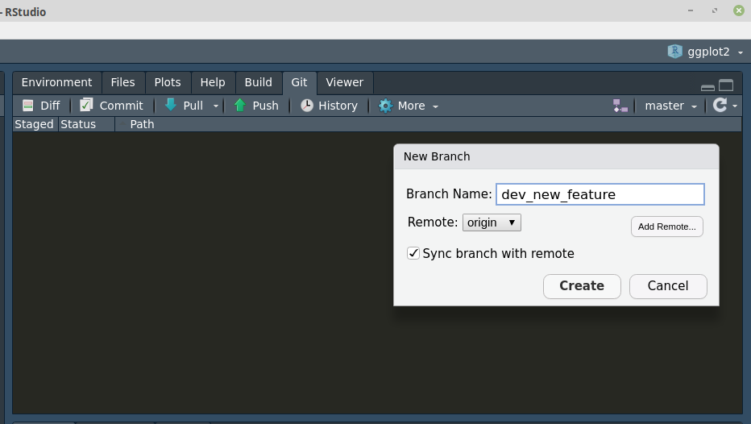

```{r setup, include=FALSE}
knitr::opts_chunk$set(dpi=300,fig.width=7)
```

## Why Git?

.pull-left[

- Version control software
- Modern software development
  - most R-packages
- Git is the __software__
- GitHub is the __platform__
]

.pull-right[


]

#### Other Plattforms
- GitLab: <https://about.gitlab.com>
- BitBucket: <https://bitbucket.org>

---
## Install Git

<https://github.com/git-guides/install-git>

#### On Linux Ubuntu

```sh
sudo apt update
sudo apt install git-all
```

#### On windows

Download manually

## Setup Local Git __Repository__

```sh
cd my_root_directory
git init
```

---
## Create a GitHub account


---
## Create (initialize) repository

#### Locally

```sh
git init
```

#### Remote


---
## Create (initialize) repository


---
## Fork a repository

- Fork someone's repo to your GitHub account


---
## Clone a repository

- Clone __your__ fork (i.e. version) to your local machine


---
## Clone a repository

#### Command line

```sh
cd Projects
git clone git@github.com:andschar/MOD3.git # SSH
git clone https://github.com/andschar/MOD3.git # HTTPS
```

#### RStudio


---
## RStudio


---
## RStudio


---
class: center, inverse, middle
## First repository (i.e. fork) !!


---
class: inverse, center, middle
## Local changes

Make changes to the `.txt`, `.R`, `.python` or to whatever file...


---
## Stage your changes

```sh
git add file.txt
git add *.txt
git add -A
```

---
## Commit changes

```sh
git commit -m 'Patch-1'
```


---
## Push to your repo (origin)

```sh
git push origin master
git push origin main
```


---
## Pull Request

#### From your main branch to the remote main branch


---
## Git/Github Workflow

```{r workflow-image, echo=FALSE, out.width="600px"}

```

---
## Git/Github Workflow

1. Create or Fork a repo

2. Clone the repo to local machine

3. Local changes

4. Stage (i.e. add) & Commit changes to Git tree

5. Push to origin

6. Create a Pull-Request against the remote repository

---
class: center, inverse, middle
# Branches


---
## Branch

#### Create/Switch Branch

```sh
git checkout -b dev_new_feature
git checkout master
git status
git branch
```



---
## Branch

```{r workflow-branches-image, echo=FALSE, out.width="600px"}

```

---
## Branch

#### Merge Branch

```sh
git checkout master
git merge dev_new_feature
```

---
## Branch

#### Merge example

First 8 commits of my R-package repo: __andschar/dbreport__

```sh
git log --all --decorate --oneline --graph
```


---
## Branch

#### Pull / Merge Request

From your dev_XXX branch to a new remote dev_XXX branch


---
class: inverse, center, middle

# R solutions

---
## {usethis} & {gert} package

```{r usethis-gert1, eval=FALSE}
gert::git_commit()
usethis::pr_pull()
usethis::pr_push()
```

```{r usethis-gert1-image, echo=FALSE, out.width="650px"}
knitr::include_graphics("https://www.garrickadenbuie.com/blog/pull-request-flow-usethis/usethis-pr-flow-medium.jpg")
```

.foot-note[
<https://www.garrickadenbuie.com/blog/pull-request-flow-usethis>
]

---
background-image: url(https://i.redd.it/wr308dmuydd71.png)
background-size: 40%
background-position: 90%, 50%

## {usethis} & {gert} package

```{r usethis-gert2, eval=FALSE}
gert::git_commit()
usethis::pr_pull()
usethis::pr_push()
```

- Convenience __wrapper__ around git

- Advantage:

    - Easier to use
    
- Disadvantage:

  - More software to maintain
  
  - Might break something in the future
  
  - You might not always use R in your career
  
---
class: center, inverse, middle


---
## Material

- OpenOlat
- StackOverflow
- YouTube
- <https://guides.github.com/activities/hello-world>
- <https://support.rstudio.com/hc/en-us/articles/200532077-Version-Control-with-Git-and-SVN>
- <https://ohshitgit.com>
- <https://www.garrickadenbuie.com/blog/pull-request-flow-usethis>

### Made with
- <https://github.com/rstudio/rmarkdown>
- <https://github.com/yihui/knitr>
- <https://github.com/yihui/xaringan>

---
## Task: RMarkdown & Git

- __Fork__ the MOD3 test repo: <https://github.com/andschar/MOD3>
- __Clone__ the repo to your local machine
- Create a new branch named dev_YOURSURNAME
- Change the file _task.Rmd_ according to the steps described in the file
- Create (i.e. knit) a .html out of the .Rmd file
- __Stage__ & __Commit__ both files in the new branch
- __Push__ your local changes to your repo (HINT: this might cause some trouble ;))
- Create a __Pull Request__ against my original repo <andschar/MOD3-student>

---
layout: false
# [Introduction to Git & GitHub](https://andschar.github.io/teaching/GIT)

## Thank you for your attention!

### Slides: <https://andschar.github.io/teaching/GIT>

__Andreas Scharmüller__<br>

Quantitative Landscape Ecology<br/>
iES Landau, Institute for Environmental Sciences<br>
University of Koblenz-Landau<br>
University of Strasbourg

 @andschar <br/>
 andschar@protonmail.com


