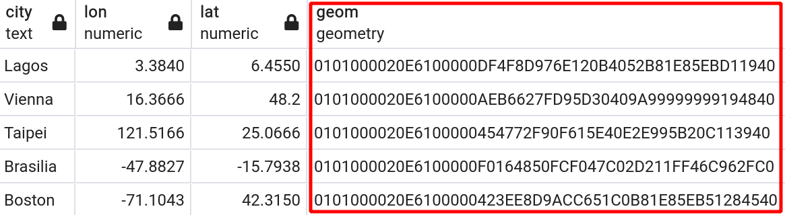

```{r setup, include=FALSE}
# markdown
knitr::opts_chunk$set(echo = FALSE,
                      message = FALSE,
                      warning = FALSE,
                      dpi = 180)
# packages
require(sf)
require(ggplot2)
# variables
datadir = '~/Projects/teaching/PostGIS/data/geo'
# plot
theme_set(theme_minimal())
```

```{r data, include=FALSE}
# palar River in North Italy
palar = st_read(file.path(datadir, 'palar_river.gpkg'),
                 fid_column_name = 'fid')
corine = st_read(file.path(datadir, 'palar_corine.gpkg'),
                 fid_column_name = 'fid')
```

background-image: url(https://d1.awsstatic.com/rdsImages/postgresql_logo.6de4615badd99412268bc6aa8fc958a0f403dd41.png)
background-position: 80% 80%

## What is PostGIS ?

- It's FOSS!

- Spatial extension for the relational database PostgreSQL

- Compliant with the Open Geospatial Consortium (OGC) standards
  <br><https://www.ogc.org>

- Simple Feature Access
  <br><https://en.wikipedia.org/wiki/Simple_Features>
  
    - `ST_Area()`
    - `ST_Length()`
    - `ST_Intersection()`
    - `ST_Intersects()`
    - `...`


---
background-image: url(https://upload.wikimedia.org/wikipedia/commons/7/7b/Logo_square_postgis.png)
background-position: 80% 80%

## What is PostGIS ?

- Spatial extension for the relational database PostgreSQL

    - Geospatial Data Type
        - Point
        - Line
        - Polygon
        - Geometry Collection
        - Raster
        
    - (Spatial) Indices


---
## Why not use a Shapefile?

.pull-left[
### ArcGIS (proprietary)


```{r}
require(sf)

cities = data.frame(city = c('Lagos', 'Vienna', 'Taipei', 'Brasilia', 'Boston'),
                    lon = c(3.3840, 16.3666, 121.5166, -47.8827, -71.1043),
                    lat = c(6.4550, 48.2, 25.0666, -15.7938, 42.3150))
cities = st_as_sf(cities, coords = c('lon', 'lat'), crs = 4326)

tmp = tempdir()
st_write(cities, file.path(tmp, 'cities.shp'), append = FALSE, quiet = TRUE)
cat(list.files(tmp, 'cities'), sep = '\n')

# SQL ----
# SELECT
#   city,
#   lon,
#   lat,
#   ST_SetSRID(ST_MakePoint(lon, lat), 4326) AS geom
# FROM (
#   SELECT
#   UNNEST(ARRAY['Lagos', 'Vienna', 'Taipei', 'Brasilia', 'Boston']) AS city,
#   UNNEST(ARRAY[3.3840, 16.3666, 121.5166, -47.8827, -71.1043]) AS lon,
#   UNNEST(ARRAY[6.4550, 48.2, 25.0666, -15.7938, 42.3150]) AS lat
# ) foo
```

]

.pull-right[
### PostGIS

- Geo-Information

    - __One table__
    - __One Column__

]

---
## Why not use a Shapefile?

.pull-left[

<br><br>

- Easy data storage (comapared on standard GIS software)

- Standard simple feature formatting allows spatial data to be accessed by other software

- Automation of processes

- Handling of large data-sets

]

.pull-right[
### PostGIS

- Geo-Information

    - __One table__
    - __One Column__

]

---


Illustration (c) by [Allison Horst](https://github.com/allisonhorst/stats-illustrations/blob/master/rstats-artwork/sf.png)


---
# Geo Libraries

- [GDAL](https://gdal.org) - Geo Data Abstraction Library


- [GEOS](https://libgeos.org) - Geometry Engine, Open Source


- [PROJ](https://proj.org)


---
class: center, inverse, middle
## PostGIS functions

---
## Palar River Example


---
## Palar River Example

```{r}
knitr::kable(palar[1:3,])
```


```{r fig.width=4, fig.height=2}
ggplot() +
  geom_sf(data = palar, aes(col = fid)) +
  theme(legend.position = 'none',
        axis.text = element_blank())
```

---
## Union

```{sql eval=FALSE, echo=TRUE}
SELECT ST_Union(geom) AS geom
FROM palar
```

```{r eval=FALSE, echo=TRUE}
palar |>
  st_union()
```

```{r fig.width=4, fig.height=2}
palar |>
  st_union() |>
  ggplot() +
    geom_sf() +
    theme(legend.position = 'none',
          axis.text = element_blank())
```

---
## Length

```{sql eval=FALSE, echo=TRUE}
SELECT ST_Length(ST_Union(geom)) geom
FROM palar
```

```{r echo=TRUE}
palar |>
  st_union() |>
  st_length()
```

---
## Buffer - 100m

```{sql eval=FALSE, echo=TRUE}
SELECT ST_Buffer(ST_Union(geom), 100) AS geom_buf
FROM palar
```

```{r eval=FALSE, echo=TRUE}
palar |>
  st_union() |>
  st_buffer(100)
```

```{r fig.width=4, fig.height=2}
palar_buf = palar |>
  st_union() |>
  st_buffer(100)

ggplot() +
  geom_sf(data = palar_buf) +
  theme(legend.position = 'none',
        axis.text = element_blank())
```

---
## Area

```{sql eval=FALSE, echo=TRUE}
SELECT ST_Area(ST_Buffer(ST_Union(geom), 100)) AS area
FROM palar
```

```{r echo=TRUE}
palar |>
  st_union() |>
  st_buffer(100) |>
  st_area()
```

---
## Convex Hull

```{sql eval=FALSE, echo=TRUE}
SELECT ST_ConvexHull(geom) AS geom
FROM palar
```

```{r eval=FALSE, echo=TRUE}
palar |>
  st_union() |>
  st_convex_hull()
```

```{r, fig.width=4, fig.height=2}
palar |>
  st_union() |>
  st_convex_hull() |>
  ggplot() +
  geom_sf() +
  geom_sf(data = palar) +
  theme(axis.text = element_blank())
```

---
## Projections

```{sql eval=FALSE, echo=TRUE}
SELECT ST_SRID(geom)
FROM palar
LIMIT 1
```

```{r eval=FALSE, echo=TRUE}
st_crs(palar) # 3035
```

### Transform

```{sql eval=FALSE, echo=TRUE}
CREATE TABLE palar2 AS 
  SELECT fid, ST_Transform(geom, 4326) geom -- EPSG for WGS84
  FROM palar
```

<https://epsg.io/4326>

---
## Intersection

- Aim: Intersect 500m River Buffer with [CORINE - LULC](https://land.copernicus.eu/pan-european/corine-land-cover) data

```{r fig.width=6, fig.height=4}
ggplot() +
  geom_sf(data = corine, aes(fill = label)) +
  geom_sf(data = palar, size = 1.5, col = 'blue') +
  labs(fill = 'Land Use')
```

---
## Intersection

```{sql eval=FALSE, echo=TRUE}
SELECT
  cor.label, cor.label,
  ST_Intersection(ST_Buffer(riv.geom, 500), cor.geom) geom
FROM
  palar riv,
  corine cor
WHERE ST_DWithin(tbl1.geom, tbl2.geom, 500)
```

```{r fig.width=4, fig.height=2}
st_intersection(st_buffer(st_union(palar), 500), corine) |>
  ggplot() +
  geom_sf() +
  theme(axis.text = element_blank())
```

---
## Intersection

```{r eval=FALSE, echo=TRUE}
st_intersection(st_buffer(st_union(palar), 500), corine)
```

---
class: center, inverse, middle
# Idexing

---
## Index

- Extremely important for performance!

- Different Indices for different data types

    - PRIMARY KEY
    
    - BTREE
    
    - __GIST__ - Geographic Data


<http://postgis.net/workshops/postgis-intro/indexing.html>

---
## Index

```{sql eval=FALSE, echo=TRUE}
CREATE INDEX corine_label_btree_idx ON corine USING BTREE (label);
CREATE INDEX palar_geom_gist_idx ON palar USING GIST (geom);
```

---
## Resources

- R sf cheatsheet

<https://raw.githubusercontent.com/rstudio/cheatsheets/main/sf.pdf>

- Gentle Introduction to PostGIS

<https://medium.com/innovation-and-technology/part-1-postgis-at-the-city-of-boston-9476293d71c2>

<https://medium.com/@paylakatel/part-2-postgis-at-the-city-of-boston-711cf30cf1f3>

<https://medium.com/@paylakatel/part-3-postgis-at-the-city-of-boston-98b83b0d1503>


---
## Slides

- OLAT
- <https://andschar.github.io/teaching/PostGIS-intro.html>


### Made with
- <https://github.com/rstudio/rmarkdown>
- <https://github.com/yihui/knitr>
- <https://github.com/yihui/xaringan>

---
layout: false
# [Introduction to Git & GitHub](https://andschar.github.io/teaching/GIT.html)

## Thank you for your attention!

### Material: <https://andschar.github.io/teaching>

__Andreas Scharmüller__<br>

Quantitative Landscape Ecology<br/>
iES Landau, Institute for Environmental Sciences<br>
University of Koblenz-Landau<br>
University of Strasbourg

 @andschar <br/>
 andschar@protonmail.com


