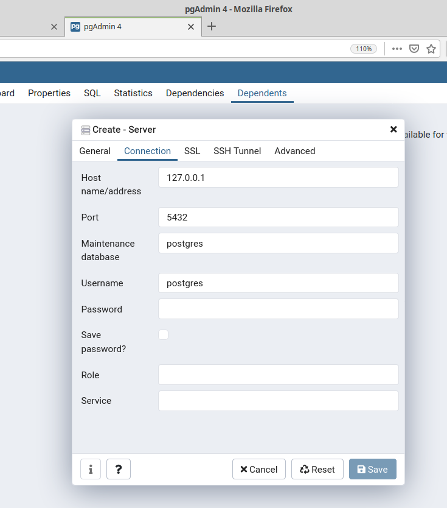
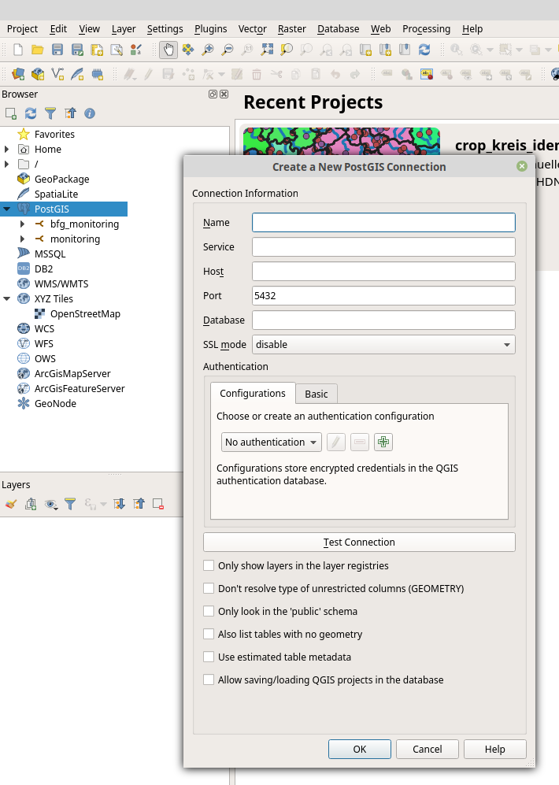

```{r setup, echo=FALSE, include=FALSE}
# packages
require(tweetrmd)

# knitr settings
knitr::opts_chunk$set(dpi = 300, fig.width = 7)
```

## Installation

#### Windows

<https://www.postgresql.org/download/windows>

#### Mac OS X

<https://www.postgresql.org/download/macosx>

#### Linux (Debian-based)

```{sh eval=FALSE}
sudo sh -c 'echo "deb http://apt.postgresql.org/pub/repos/apt $(lsb_release -cs)-pgdg main" > /etc/apt/sources.list.d/pgdg.list'
wget --quiet -O - https://www.postgresql.org/media/keys/ACCC4CF8.asc | sudo apt-key add -
sudo apt-get update
sudo apt-get -y install postgresql
```

---
## What is SQL?

- SQL - Structured Query Language

- Database software

- Standard:	ISO/IEC 9075 (since 1987)

--

## The typical query

```sql
SELECT
  city_name,
  country,
  population
FROM cities
WHERE country = 'Austria'
```

--

#### R

```r
require(data.table)
require(dplyr)
```

---
## Why SQL?

```{r echo=FALSE}
tweetrmd::include_tweet("https://twitter.com/thosjleeper/status/1320831268611936256")
```

---
## SQL Software

.pull-left[

## FOSS


]

.pull-right[

## Proprietary


]

---
class: center, inverse, middle
## Queries

---
## Queries - The typical query

```sql
SELECT
  city_name,
  country,
  population
FROM cities
WHERE country = 'Austria'
```


---
## Queries - Example data set

- R - iris dat set

- Dimensions: `r dim(iris)`


```{r echo=FALSE}
knitr::kable(head(iris))
```

---
## Queries - SELECT

```sql
SELECT
  sepal_length,
  species AS new_name
FROM iris
```

--
```sql
SELECT * -- wildcard
FROM iris 
LIMIT 10
```

--
#### Schema
```sql
SELECT *
FROM my_schema.iris
LIMIT 10
```

--
#### PostgreSQL adressing

```sql
database.schema.table.column
```
---
## Queries - WHERE

```sql
SELECT
  sepal_length,
  species AS fancy_name
FROM iris
WHERE species = 'setosa'
  AND sepal_length < 5
```

--

#### R-equivalent

```r
# data.table
data.table::setDT(iris)
iris[ Species == 'setosa' & Sepal.Length < 5 ]
# dplyr
iris %>% 
  dplyr::filter(Species == 'setosa' & Sepal.Length < 5)
```

--

#### Different syntax, same logic!

---
## Queries - GROUP BY

```sql
SELECT
  species,
  count(species) AS n,
  max(sepal_length) AS max_sl,
  avg(sepal_length) AS mean_sl
FROM iris
GROUP BY species
```

--

#### R-equivalent

```r
# data.table
dt = data.table::as.data.table(iris)
dt[ ,
    .(.N,
      max_sl = max(Sepal.Length)),
    Species ]
# dplyr
iris %>%
  group_by(Species) %>%
  summarise(n = n(),
            max_sl = max(Sepal.Length))
```

---
## Queries - ORDER BY

```sql
SELECT
  species,
  count(species) AS n,
  max(sepal_length) AS max_sl,
  avg(sepal_length) AS mean_sl
FROM iris
GROUP BY species
ORDER BY max_sl DESC -- ASC
```

---
## Queries - HAVING

Same as `WHERE`, but only after `GROUP BY`.

```sql
SELECT
  species,
  count(species) AS n,
  max(sepal_length) AS max_sl,
  avg(sepal_length) AS mean_sl
FROM iris
GROUP BY species
HAVING species = 'versicolor'
ORDER BY max_sl DESC -- ASC
```

---
background-image: url(https://pbs.twimg.com/media/EH9FBjyWkAAIjCm?format=jpg&name=900x900)
background-size: contain

---
class: center, inverse, middle
## Queries - JOINs


---
background-image: url(https://www.dofactory.com/img/sql/sql-joins.png)
background-position: 90% 8%
background-size: 25%
## Queries - JOINs

<br>
### LEFT JOIN

```sql
SELECT *
FROM my_table1 tab1
LEFT JOIN my_table2 tab2 ON tab1.id = tab2.id 
```

--
### RIGHT JOIN
```sql
SELECT *
FROM my_table1 tab1
RIGHT JOIN my_table2 tab2 ON tab1.id = tab2.id
```

---
background-image: url(https://www.dofactory.com/img/sql/sql-joins.png)
background-position: 90% 8%
background-size: 25%
## Queries - JOINs

<br>
### INNER JOIN

```sql
SELECT *
FROM my_table1 tab1
INNER JOIN my_table2 tab2 ON tab1.id = tab2.id
```

---
class: inverse
## Queries - JOINs


---
class: center, inverse, middle
## Data types


---
## Data types

- more complex compared to R!
<https://www.postgresql.org/docs/13/datatype.html>

| name | size | description | possible values | ~R-type |
|:-----|:-----|:------------|:----------------|:---------|
| __boolean__ | 1 byte | yes, no | true, false | logical | 
| __text__ | variable | string | all | character |
| _integer_ |	4 bytes | typical choice for integer |	-2147483648 to +2147483647 | integer |
| bigint | 8 bytes | large-range integer | -9223372036854775808 to +9223372036854775807 | integer64 |
| numeric | variable | float, __exact__ | up to 131072 digits before the decimal point, 16383 after | numeric |
| __double precision__ | 8 bytes | float | 15 decimal digits precision | numeric |
| date | date | date | 4713 BC to	5874897 AD | date |
| geometry | variable | Geographic information | | sfc |

---
## Special symbols

| Smbol | Description |
|:------|:------------|
| -- | One-line comment |
| /\* Comment this \*/ | Multi-line comment |
| * | Wildcard, meaning _all_ |
| ; | End query |


---
class: center, inverse, middle
## Connect


---
## Connect

#### Command Line Interface
```sh
psql -d 'my_db' -c 'SELECT * FROM my_table'
```

#### R, python, etc. clients
```r
require(RPostgreSQL)
```

#### Graphical User Interfaces

- pgAdmin4
- dbeaver
- QGIS

---
## Connect - pgAdmin



---
## Connect - QGIS




---
## Connect - R

### Read

```r
require(RPostgreSQL)

drv = dbDriver('PostgreSQL')
con = DBI::dbConnect(drv,
                     host = '127.0.0.1',
                     port = 5432,
                     dbname = 'my_db',
                     user = 'my_user',
                     password = 'my_password')

q_get = "SELECT *
         FROM my_table
         LIMIT 10"

dat = dbGetQuery(con, q) # a data.frame

dbDisconnect(con)
dbUnloadDriver(drv)
```

---
class: center, inverse, middle
## Careful, credentials!


---
## Connect - R

### Separate file for credentials

`~/credentials.R`

```r
host = '127.0.0.1'
port = 5432
user = 'my_user'
password = 'my_password'
```

---
## Connect - R

### Read

```r
source('credentials.R') # credentials

drv = dbDriver('PostgreSQL')
con = DBI::dbConnect(drv,
                     host = host,
                     port = port,
                     dbname = 'mydb',
                     user = user,
                     password = password)

q_get = "SELECT *
         FROM my_table
         LIMIT 10"

dat = dbGetQuery(con, q) # a data.frame

dbDisconnect(con)
dbUnloadDriver(drv)
```

---
## Connect - R

### Write

```r
source('credentials.R') # credentials

drv = dbDriver('PostgreSQL')
con = DBI::dbConnect(drv,
                     host = host,
                     port = port,
                     dbname = 'mydb',
                     user = user,
                     password = password)

dbWriteTable(con,
             name = c('schema', 'tbl'),
             value = iris, # data set
             overwrite = TRUE,
             row.names = FALSE)

dbDisconnect(con)
dbUnloadDriver(drv)
```

---
## Connect - R

### Send

```r
source('credentials.R') # credentials

drv = dbDriver('PostgreSQL')
con = DBI::dbConnect(drv,
                     host = host,
                     port = port,
                     dbname = 'mydb',
                     user = user,
                     password = password)

q_send = "ALTER TABLE my_table ADD COLUMN col_new text;"
dbSendQuery(con, q_send)

dbDisconnect(con)
dbUnloadDriver(drv)
```

---
class: center, inverse, middle
## Differences SQL & R

---
## Differences

.pull-left[

### PostgreSQL

- database
- data on disk
  - unlimited rows, 250-1600 columns
  - (partly) slow

]

.pull-left[

### R

- programming language
- data in memory
  - limited
  - fast

]


---
class: center, inverse, middle
## Advanced Queries

---
## Queries - SELECT

```sql
SELECT
  CASE
    WHEN column1 < 10
    THEN 'small'
    ELSE 'large'
  END AS column1_categories,
  column2
FROM my_table
LIMIT 1e3
```

#### R-equivalent

```r
data.table::fcase()
dplyr::case_when()
```

---
## Queries - CEATE TABLE

```sql
CREATE new_table (
  SELECT
    tab1.id PRIMARY KEY,
    tab1.column1
  FROM my_table1 tab1
  INNER JOIN my_table2 tab2 ON tab1.id = tab2.id
)
```

---
## Queries - INSERT INTO

```sql
INSERT INTO my_table (id)

```

---
## Queries - UPDATE

```sql
UPDATE my_table SET
  col = 
```

---
## Queries - WINDOW FUNCTIONS


---
## Indexes

TODO


---
## Material

PostgreSQL: <https://www.postgresql.org/docs/13/index.html>

freeCodeCamp: <https://www.freecodecamp.org/news/sql-and-databases-full-course>

Data Camp: <https://www.datacamp.com/courses/introduction-to-sql>

Julia Evans (@b0rk): <https://wizardzines.com/comics/sql-query-order>

YouTube

---
## Slides

- OLAT
- <https://andschar.github.io/teaching>


### Made with
- <https://github.com/rstudio/rmarkdown>
- <https://github.com/yihui/knitr>
- <https://github.com/yihui/xaringan>


---
class: center, middle, inverse

# Thank you for your attention!


